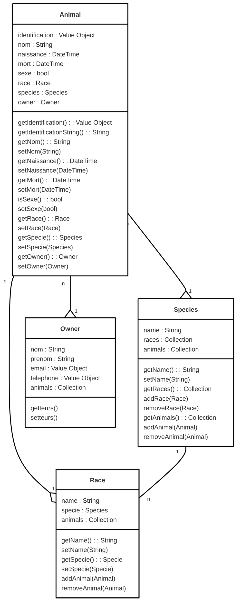

# Anicare — Plateforme de Gestion Globale pour Cabinets Vétérinaires  

## Sommaire
* [1. Présentation](#1--présentation)
* [2. Fonctionnalités](#2--fonctionnalités-clés)
* [3. Architecture](#3--architecture-technique)
* [4. Sécurité et Conformité](#4--sécurité--conformité)

## 1. 📚 Présentation
Anicare est une solution SaaS de gestion intégrée (ERP/CRM) conçue sur mesure pour les cabinets et cliniques vétérinaires. Elle centralise le suivi médical, l'organisation administrative et la gestion financière au sein d'une interface unique, sécurisée et intuitive.

## 2. 🌟 Fonctionnalités Clés
### 🩺 Suivi Médical & Dossier Patient  
 * ***Dossier médical centralisé*** : Historique complet des consultations et examens cliniques par animal.  
 * ***Prescriptions & Registre des Médicaments*** : Édition d'ordonnances sécurisées et tenue automatique du registre d'ordonnancier.  
 * ***Rappels automatiques*** : Envoi d'alertes SMS/E-mail configurables pour les rappels de vaccination et de soins récurrents.  

### 📅 Agenda & Gestion des Rendez-vous  
 * ***Agenda en temps réel multi-utilisateurs*** : Synchronisation instantanée entre vétérinaires et secrétariat.  
 * ***Espace Maître (Propriétaire)*** : Interface dédiée permettant aux clients de prendre, consulter ou reporter leurs rendez-vous en ligne.  
 * ***Gestion des droits d'accès*** : Modification, annulation et surréservation réservées à l'équipe administrative et aux praticiens.  

### 💳 Comptabilité, Facturation & Télétransmission  
 * ***Facturation & Caisse*** : Édition automatisée des factures, devis, règlements clients et suivi de la caisse journalière.  
 * ***Télétransmission*** : Transmission sécurisée des données d'encaissement.  
 * ***Exports comptables*** : Compatibilité ascendante avec les logiciels de comptabilité standard du marché (Sage, CEGID, Quadratus, etc.).  

## 3. 🔨 Architecture Technique
| Composant     | Technologie utilisée  |
| ------------- | -------------         |
| Frontend      | Vue.js                |
| Backend       | Symfony               |
| Base de données| MariaDB              |
  
## 4. 🔒 Sécurité & Conformité
 * ***Conformité RGPD, RGESN & RGAA*** : le site sera conforme au RGESN et au RGAA.

## 5. 😯 User stories
1. Un vétérinaire doit pouvoir consulter le dossier médical d'un animal pour assurer un suivi.
2. Un vétérinaire doit pouvoir créer une ordonnance, l'enregistrer et l'imprimer.
3. L'assistant(e) du vétérinaire doit pouvoir gérer l'agenda du vétérinaire.
4. L'assistant(e) du vétérinaire doit pouvoir éditer une facture.
5. Un propriétaire peut prendre un rendez-vous en ligne depuis son espace.
6. Un propriétaire peut prendre consulter le dossier médical de son animal.
7. Un vétérinaire et l'assistant(e) doit pouvoir exporter les données comptables.
8. Un vétérinaire et l'assistant(e) doit pouvoir envoyer des rappels automatiques.
9. Un vétérinaire et l'assistant(e) doit pouvoir gérer les stocks de médicament.

## 5. Diagramme de classe

